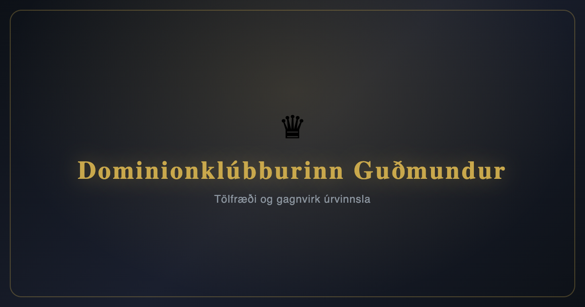

# ♛ Dominionklúbburinn Guðmundur

**[dominion.arnlaugsson.info](https://dominion.arnlaugsson.info)**

Tölfræði og gagnvirk úrvinnsla fyrir Dominionklúbbinn Guðmund — an interactive statistics dashboard for our [Dominion](https://boardgamegeek.com/boardgame/36218/dominion) board game club.



## Features

- **Dashboard** — club stats, random card of the day, player of the day
- **Players** — win rates, head-to-head records, score trends
- **Games** — full history with searchable game details, kingdom cards, results
- **Cards** — browse all cards with usage stats, filter by expansion and type
- **Fun Facts** — longest win streaks, highest scores, rivalries, and more
- **Kingdom Suggester** — generate balanced kingdoms from your owned expansions

## Data Pipeline

Game data lives in a [Google Spreadsheet](https://docs.google.com/spreadsheets/d/14f5TW05_jpnWGf6d3cAO7ChSrHPZl0dIbxyIO3qqe2A) maintained by the club. A GitHub Actions workflow syncs it automatically:

1. Downloads the spreadsheet as XLSX every 2 hours
2. Parses all games with `openpyxl` (`scripts/sync_spreadsheet.py`)
3. Writes `data/dominion_data.json`
4. Commits changes and deploys to Firebase Hosting

Code changes pushed to `main` also trigger a build and deploy.

## Tech Stack

- **Frontend**: React 18, Vite 5, Chart.js
- **Hosting**: Firebase Hosting
- **Data sync**: Python 3 + openpyxl, GitHub Actions
- **CI/CD**: GitHub Actions (cron sync + push deploy)

## Development

```bash
npm install
npm run dev
```

To sync data locally from the spreadsheet:

```bash
pip install openpyxl
python3 scripts/sync_spreadsheet.py
```

## License

A private project for the Guðmundur Dominion club.
